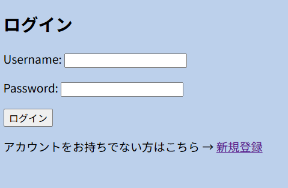
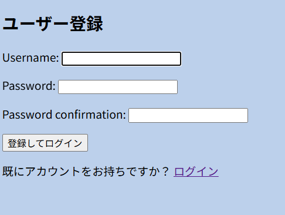
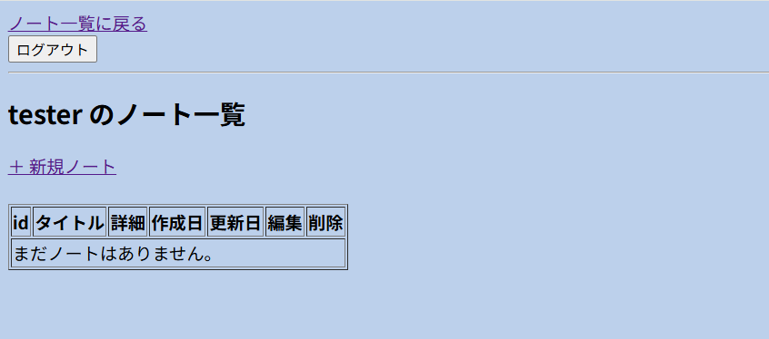
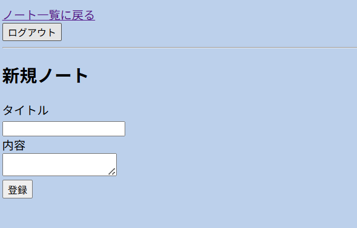
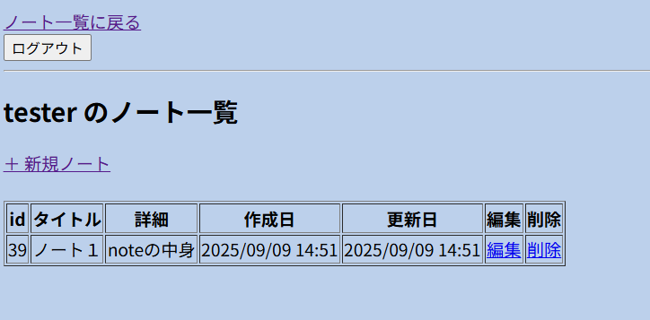
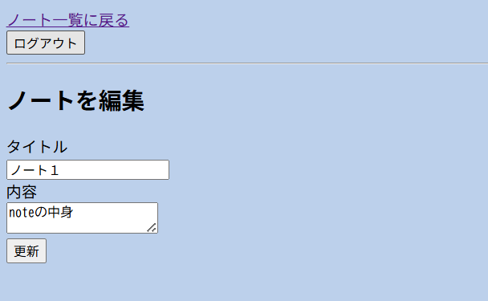
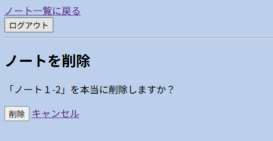

Simple Notes API（DRF）

# 目標
- ログイン、ログアウトの実装
- タイトルと本文を持つノートをCRUDできるシンプルなAPIを構築
- PostmanやブラウザでAPIを動作確認できるようにする

# スキルセット
- Django基礎（プロジェクト作成、モデル、マイグレーション）
- REST APIの基本（CRUD: Create, Read, Update, Delete）
- PostmanでのAPIテスト
- 開発環境はdockerを用いる

# アプリイメージ
ログイン画面

ユーザの新規作成

ホーム画面

新規ノート作成

新規作成後のホーム

編集画面

削除確認
